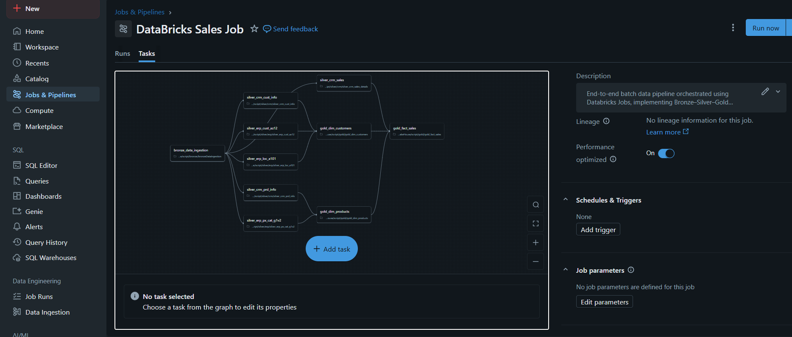

# DataBricks Data Lakehouse Pipeline

## Overview

This project demonstrates an end-to-end batch data engineering pipeline built using Databricks, following the Bronze–Silver–Gold (Medallion) architecture.
The pipeline ingests raw data, performs structured transformations, and produces analytics-ready fact and dimension tables.

## Architecture (Medallion Pattern)
- ### *Bronze Layer*
  - Raw data ingestion from source systems
  - Minimal transformations to preserve source fidelity

- ### *Silver Layer*
  - Data cleaning and standardization
  - Schema alignment across CRM and ERP sources
  - Handling null values, data types, and date formats

- ### *Gold Layer*
  - Business-ready dimension tables
  - Analytics-ready fact table
  - Optimized for reporting and downstream consumption

## Data Processing Workflow
- Ingested raw sales-related data into the Bronze layer
- Transformed and normalized CRM and ERP datasets into the Silver layer
- Built Gold dimension tables (customers, products)
- Created a Gold fact table for sales analytics
- Validated joins, keys, and data consistency across layers

## Pipeline Orchestration
- Orchestrated the complete workflow using Databricks Jobs
- Defined task dependencies to enforce correct execution order
- Implemented a single pipeline covering Bronze → Silver → Gold
- Executed the pipeline multiple times successfully

### Pipeline Orchestration

## Pipeline Execution & Monitoring
- Executed the pipeline as a batch job
- Tracked execution duration and task-level status
- Verified successful job runs via Databricks Job history

### Job Run History

## Technologies Used
- Databricks
- PySpark
- Spark SQL
- Delta Lake
- Databricks Jobs (orchestration)

## Key Learnings
- Designed and implemented a production-style data pipeline
- Gained hands-on experience with Databricks Jobs orchestration
- Applied medallion architecture principles in practice
- Improved debugging skills for joins, schemas, and transformations
- Learned how to document pipelines professionally using GitHub

## Notes
- This is a batch processing pipeline
- Designed to follow real-world data engineering practices
